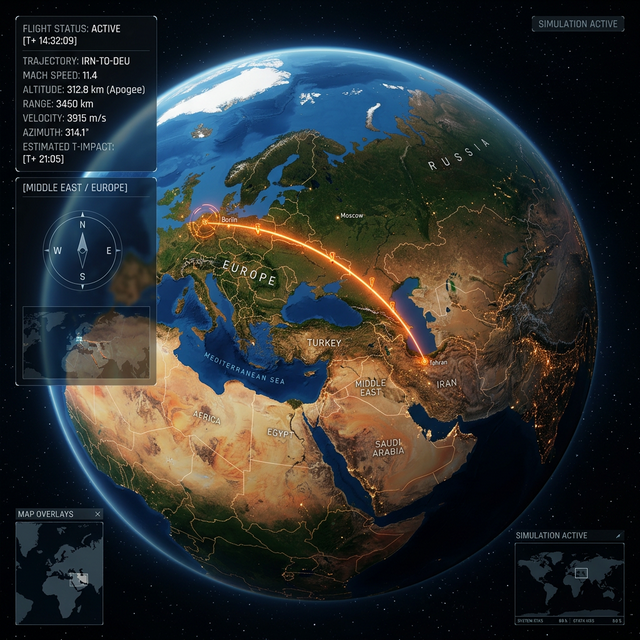

# 🚀 AIBallistic

A high-fidelity ICBM and ballistic missile flight simulator built with **Rust** and the **Bevy** engine. Performance-optimized, physics-driven, and featuring real-world orbital mechanics.



## 🌟 Key Features

- **Global Physics Engine**: Realistic 3D Earth simulation including gravitational gradients.
- **Fictitious Forces**: Accurate modeling of **Coriolis** and **Centrifugal** accelerations.
- **ISA Atmosphere**: Integrated International Standard Atmosphere (ISA) model for drag and Isp calculations.
- **Missile Registry**: Extensive library of real-world specifications (Iranian, US, Chinese, French, and Indian models).
- **CLI-Driven Selection**: Powerful command-line interface for listing and selecting simulation models.
- **Real-time UI**: Professional dashboard showing altitude, Mach speed, flight timer, and distance-to-target.

## 🛠 Installation

Ensuring you have [Rust](https://rustup.rs/) installed:

```bash
git clone https://github.com/jblestang/AIBallstic.git
cd AIBallstic
cargo build --release
```

## 🎮 How to Run

### List Available Missiles
To view the full missile registry:
```bash
cargo run --release -- --list
```

### Run Simulation with Specific Model
To launch a specific missile (e.g., Minuteman III):
```bash
cargo run --release -- --missile "Minuteman"
```
*Note: Partial name matches are supported.*

### Default Launch
Simply running without arguments launches the default **Khorramshahr-4**:
```bash
cargo run --release
```

## 🕹 Controls

- **Mouse Drag**: Rotate Camera
- **Scroll / I / O**: Zoom In/Out
- **Space**: Toggle Planet Rotation
- **ESC**: Exit Simulation

## 🌍 Simulation Domain

The simulation tracks trajectories from launch sites (defaulting to Tehran) to global targets (defaulting to Moscow), accounting for Earth's rotation and varying atmospheric density.

---
*Built with ❤️ by the AIBallistic Team*
